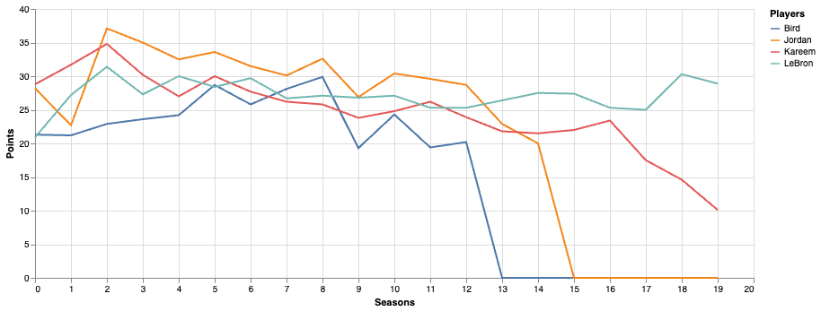
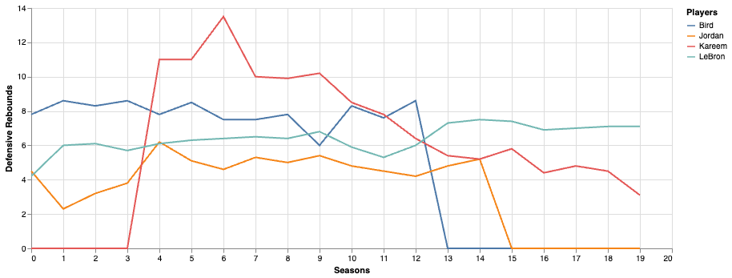
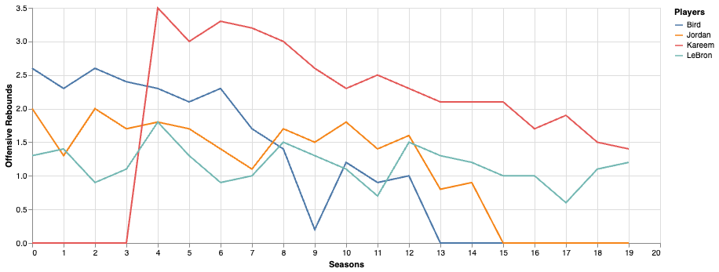
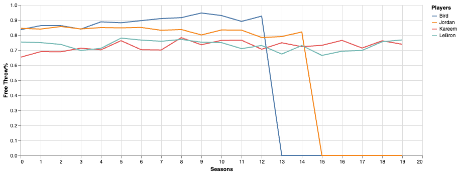

# NBA player API


NBA player API with full information about each player in NBA history.
The API can provide information about the player's general data, career highs,
regular season stats and post season stats. NBA teams and games will be added as well. 

# Table of contents
* [Endpoints](#Endpoints)
* [Technologies](#Technologies)
* [Usage](#Usage)
* [Demos](#Demos)
* [License](#License)

## Endpoints
 - https://www.nba.sportcentre.info/get-player/$id (int) - Get Player Data
 - https://www.nba.sportcentre.info/search-player/$name (string) - It is advisable to search for a last name, the result will be all players that match the name along with their IDs
 - https://www.nba.sportcentre.info/regular-seasons/player/$id (int) - Search for all regular season stats for a given player
 - https://www.nba.sportcentre.info/post-seasons/player/$id (int) - Search for all post season stats for a given player 
 - https://www.nba.sportcentre.info/career-high/player/$id (int) - Search for career high


---
**NOTE**

All information was last updated after the 2022-2023 season. New players from the latest draft are not added.

---

## Technologies
 - Python 3.9
 - PostgreSQL 15 
 - Flask Restful

## Usage

```https://www.nba.sportcentre.info/search-player/bird```

    [
        {
            "name": "Jabari Carl Bird",
            "id": 3501
        },
        {
            "name": "Jerry Lee Bird",
            "id": 3502
        },
        {
            "name": "Larry Joe Bird",
            "id": 3503
        },
        {
            "name": "Otis Lee Birdsong",
            "id": 3504
        }
    ]
---
```https://www.nba.sportcentre.info/get-player/3503```
  
    {
        "assists": "6.3",
        "field_goals": "37.6",
        "nicknames": "\n(Larry Legend, The Hick from French Lick, Kodak, The Great White Hope)\n",
        "games": "897",
        "total_rebounds": "10.0",
        "fg_percent": "49.6",
        "win_shares": "145.8",
        "name": "Larry Joe Bird",
        "points_avg": "24.3",
        "per": "23.5"
    }
---
```https://www.nba.sportcentre.info/regular-seasons/player/3503```

```
[
    {
        "ft_percent": ".651",
        "orb": null,
        "mp": "",
        "tov": null,
        "two_p_percent": null,
        "lg": "baa",
        "pts": "8.3",
        "g": "56",
        "drb": null,
        "pf": "2.4",
        "tm": "phw",
        "ast": "1.6",
        "efg_percent": null,
        "fg": "3.0",
        "two_p": null,
        "blk": null,
        "trb": "",
        "three_points": null,
        "fga": "9.3",
        "two_p_a": null,
        "fgp": ".325",
        "stl": null,
        "season": "1948-49",
        "gs": "",
        "fta": "3.5",
        "ft": "2.3",
        "pos": "",
        "three_pa": null,
        "three_p_percent": null,
        "age": "26"
    }
]
```
---
```https://www.nba.sportcentre.info/post-seasons/player/3505```

```
[
    {
        "ft_percent": ".500",
        "orb": null,
        "mp": "",
        "tov": null,
        "two_p_percent": null,
        "lg": "baa",
        "pts": "9.0",
        "g": "2",
        "drb": null,
        "pf": "1.5",
        "tm": "phw",
        "ast": "1.0",
        "efg_percent": null,
        "fg": "3.5",
        "two_p": null,
        "blk": null,
        "trb": "",
        "three_points": null,
        "fga": "13.0",
        "two_p_a": null,
        "fgp": ".269",
        "stl": null,
        "season": "1948-49",
        "gs": "",
        "fta": "4.0",
        "ft": "2.0",
        "pos": "",
        "three_pa": null,
        "three_p_percent": null,
        "age": "26"
    }
]
```
---
```https://www.nba.sportcentre.info/career-high/player/3472```

```
[
    {
        "assists": "9",
        "steals": "5",
        "blocks": "5",
        "game_score": "30.3",
        "rebounds": "22",
        "triple_doubles": "0",
        "points": "28"
    }
]
```

## Demos

### Visualisations
 - Comparison of different players per regular / post season







## License

[MIT](https://choosealicense.com/licenses/mit/)
